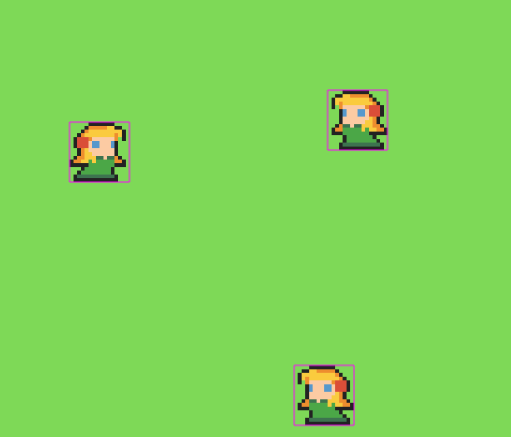

# MMORPG skeleton 🎮

MMORPG online game skeleton



## Description

An MMORPG online game make with Node.js technologies.

## Getting Started

### Dependencies

* Node.js
* MongoDB
* Redis

### Installing

* Create .env file if not exist with environment variables ( inside service folder ): 
```bash
# NOT ENVIRONMENTS VARIABLES NEEDED
```

* npm i ( inside app and service folder )
* npm build ( inside app and service folder ) # Production build

### Executing program

* npm run start:dev ( inside app and service folder ) # Run on development mode
* npm run start ( inside app and service folder ) # Run on production mode

## Authors

* Juan Carballo - jpcbdev@gmail.com

## Version History

[CHANGE LOG](/CHANGELOG.md)

## License

MIT